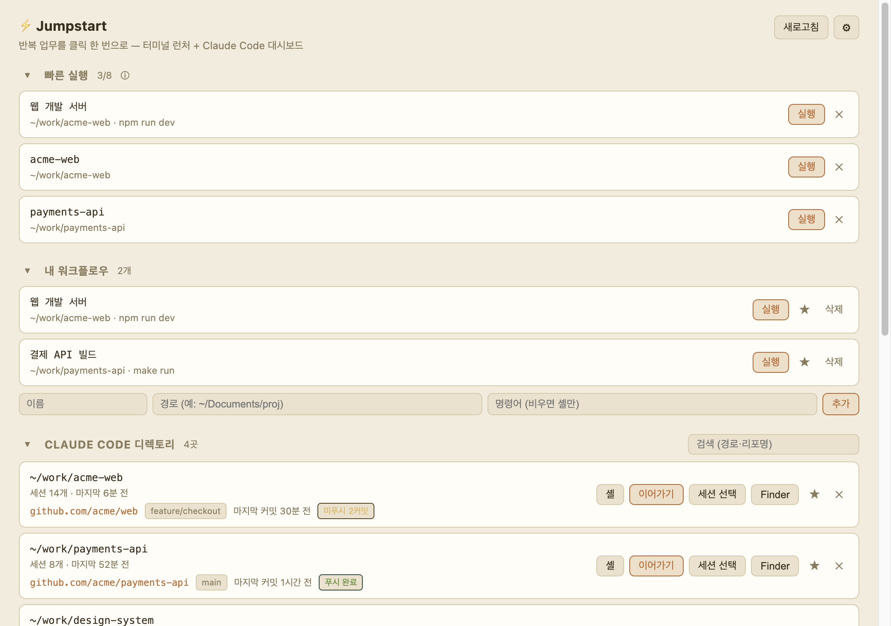

# ⚡ Jumpstart

자주 쓰는 작업(서비스 올리기·로그 보기·`claude` 실행 등)을 **클릭 한 번**으로 터미널에서
실행하는 macOS용 데스크탑 앱.



## 왜 만들었나

매번 터미널을 열고 → 프로젝트 폴더로 `cd` 하고 → 명령을 입력하는 반복이 번거로워서
만들었습니다. 자주 가는 폴더와 명령을 버튼으로 등록해 두면, 앱에서 한 번 클릭으로
**원하는 위치에 터미널이 열리고 명령까지 실행**됩니다. 덤으로 `~/.claude/projects/`를
스캔해 **Claude Code를 썼던 폴더들과 git 상태**를 한눈에 보여줍니다.

## 지원 환경 / 요구사항

- **운영체제: macOS 전용.** 터미널 실행을 `osascript` + Terminal.app으로 하기 때문에
  Windows/Linux에서는 동작하지 않습니다.
- **칩: Apple Silicon(arm64) · Intel(x64) 모두 가능.** 단, 배포 파일은 **빌드한 맥의 칩 기준**으로
  만들어집니다. 받는 사람과 칩이 다르면 해당 칩에서 다시 빌드해야 합니다.
- **Java·Python 등 별도 런타임 불필요.** 이 앱은 Electron(내부에 Node.js·Chromium 포함) 기반이라,
  받아서 쓰는 사용자는 아무것도 설치할 필요가 없습니다.
- **Node.js 18+ 는 "빌드/개발할 때만" 필요.** 아래 [다운로드해서 바로 쓰기](#다운로드해서-바로-쓰기-빌드-없이)로
  받은 앱은 Node 없이 그냥 실행됩니다.
- 첫 실행 시 **"Terminal 제어 권한"** 동의 필요 (아래 [macOS 권한](#macos-권한) 참고).

## 다운로드해서 바로 쓰기 (빌드 없이)

개발 환경 없이 받아서 바로 쓰고 싶다면:

1. **[Releases](https://github.com/tnfhrnsss/jumpstart/releases/latest)** 에서 최신 `.dmg`(또는 `.zip`)를 받습니다.
2. dmg면 열어서 `Jumpstart.app`을 `Applications`로 드래그 / zip이면 풀어서 `Applications`로 옮깁니다.
3. **첫 실행**: 코드 서명이 없어(개인용) Gatekeeper가 막을 수 있습니다 →
   `Jumpstart.app`을 **우클릭 → 열기**(최초 1회), 또는 터미널에서
   `xattr -dr com.apple.quarantine /Applications/Jumpstart.app`.

## 소스에서 빌드해 설치

직접 코드를 받아 빌드하려면 (Node.js 18+ 필요):

```bash
brew install node          # 없으면. 또는 https://nodejs.org 에서 LTS (node -v 로 v18+ 확인)
git clone https://github.com/tnfhrnsss/jumpstart.git
cd jumpstart
npm install                # 처음 한 번
bin/install.sh             # 빌드 + /Applications/Jumpstart.app 설치  (= npm run app)
```

- 코드를 수정하면 `bin/install.sh`를 다시 돌려 설치본에 반영하세요.
- 제거: `/Applications/Jumpstart.app`을 휴지통으로.

## 실행 방식 이해 (npm은 "개발용")

이 앱은 웹서버처럼 떠 있는 서비스가 아니라 **데스크탑 프로그램**입니다.

- `npm start` → 내부적으로 `electron .` 을 실행하는 **개발 모드**. `npm`은 그저 스크립트 러너이고,
  터미널이 떠 있는 동안만 창이 떠 있습니다. (개발·디버깅용)
- 실제 사용은 **설치된 `/Applications/Jumpstart.app`** — npm도 node_modules도 필요 없이,
  일반 맥 앱처럼 더블클릭으로 실행됩니다.
- 그래서 **개발 모드와 설치본은 별개**입니다. 코드 변경을 설치본에 반영하려면
  `bin/install.sh`(또는 `npm run app`)를 다시 실행하세요.

## 빌드 / 배포

빌드 스크립트는 `bin/` 에 있습니다 (각 `npm` 스크립트와 동일한 동작).

| 스크립트 | 하는 일 | npm 대응 |
| --- | --- | --- |
| `bin/install.sh` | `.app` 빌드 후 `/Applications`에 설치 | `npm run app` |
| `bin/build.sh` | 배포본(`.dmg`·`.zip`)을 `dist/`에 생성 | `npm run dmg` |
| `bin/release.sh` | 빌드 + GitHub Release 생성·자산 업로드 | — |
| `bin/screenshot.sh` | 데모 데이터로 스크린샷 PNG 생성 (개인정보 없음) | — |

- `bin/build.sh` 결과물은 `dist/Jumpstart-<버전>-<칩>.dmg` 와 `.zip`. DMG는 macOS의 `hdiutil`을
  사용하므로 일반 터미널에서 실행하세요(제한된 셸에선 dmg가 실패할 수 있고, 그땐 zip이 대안).
- **배포 (GitHub Release):**
  1. `package.json`의 `version`, `meta.json`의 `lastPatch`/`revision`을 갱신합니다.
  2. `bin/release.sh` 실행 → 태그 `vX.Y.Z`로 릴리스가 생기고 dmg/zip이 자산으로 올라갑니다.
     (gh CLI 필요: `brew install gh && gh auth login`)
  3. 수동으로 하려면: GitHub → **Releases → Draft a new release** → 태그 만들고 `dist/`의 dmg/zip 첨부.
- 받는 사람은 위 [다운로드해서 바로 쓰기](#다운로드해서-바로-쓰기-빌드-없이)의 Gatekeeper 안내를 따르면 됩니다.

### 스크린샷 (데모 모드)

README·소개 페이지용 스크린샷은 **데모 모드**로 만듭니다 — 실제 `~/.claude` 데이터 대신
가공의 샘플(acme-web 등)을 띄워 **개인정보 노출 없이** 캡처합니다.

```bash
bin/screenshot.sh docs/screenshot.png   # 데모 데이터로 자동 캡처
# 또는 직접 화면을 보며 찍기:
JUMPSTART_DEMO=1 npm start               # 데모 데이터로 실행 → ⌘⇧4 로 캡처
```
표시 테마는 현재 설정값을 따릅니다(설정에서 테마를 바꾼 뒤 다시 캡처하면 됩니다).

## 사용법

- **빠른 실행** — 즐겨찾기 목록. 아래의 **내 워크플로우 · Claude Code 디렉토리 · 자주 여는 곳**
  각 항목에 있는 **⭐ 버튼으로 추가**한 것들을 모아 한 번에 실행합니다. 항목의 **✕**로 제거.
  (기본 도구 프리셋은 더 이상 없고, 처음엔 비어 있습니다.)
- **내 워크플로우** — "이름 / 경로 / 명령어"를 등록하면 [실행] 버튼으로 새 터미널에서 자동 실행.
  명령어를 비우면 해당 경로에서 셸만 엽니다.
- **Claude Code 디렉토리** — Claude Code를 썼던 폴더별로 [셸] / [이어가기] / [세션 선택] / [Finder] 바로가기.
  **이어가기**는 최근 세션 이어가기(`claude -c`), **세션 선택**은 터미널에서 세션 목록을 띄워 골라 재개(`claude --resume`)입니다.
  우측 **검색창**으로 경로·리포명 필터. 각 폴더의 git 정보(리포·브랜치·마지막 커밋·푸시 여부)도 표시.
  폴더 이름이 바뀌거나 삭제돼 "없음"으로 뜨는 항목은 **✕** 버튼으로 숨길 수 있고,
  하단의 "모두 표시"로 되살립니다.
- **자주 여는 곳** — 실제 터미널에서 자주 `cd` 한 폴더(셸 히스토리 기반)와 이 앱으로 연 기록을
  합쳐, 접근이 잦은 곳을 모아 보여줍니다. 바로 [셸] / [이어가기] / [Finder]로 열 수 있습니다.
- **최근 실행** — 이 앱으로 실행한 기록.

> 각 섹션 제목의 **▾/▸ 화살표**(또는 제목줄 클릭)로 섹션을 **접거나 펼칠 수 있고**, 그 상태는 다음 실행에도 유지됩니다. 목록이 길어질 때 유용합니다.

## 설정 (우상단 ⚙ 버튼)

- **언어** — 한국어 / English 즉시 전환.
- **화면 테마** — 7종(Charcoal·Ocean·Forest·Plum·Nord·Sand·Light). 고르면 즉시 미리보기.
- **터미널 앱** — 명령을 실행할 터미널 선택:
  - **Terminal (macOS 기본)** · **iTerm2** · **Tabby** (설치돼 있으면 선택 가능)
  - **사용자 지정** — kitty·WezTerm·Alacritty·Warp 등을 명령 템플릿으로.
    치환자: `{{script}}` `{{dir}}` `{{cmd}}` `{{shell}}`
    (예: kitty `kitty {{script}}` · WezTerm `wezterm start -- {{script}}`)
- **열기 방식** — 새 창 / 새 탭. 새 탭은 **Terminal·iTerm2만** 지원합니다
  (Terminal은 첫 사용 시 "손쉬운 사용" 권한 필요 · Tabby/사용자 지정은 무시).
- (빠른 실행은 설정이 아니라, 각 목록의 ⭐ 버튼으로 직접 추가합니다.)

## 데이터 저장 위치

설정·북마크·히스토리는 프로젝트가 아니라 사용자 폴더에 저장됩니다
(`~/Library/Application Support/jumpstart/`): `settings.json`, `bookmarks.json`,
`launch-history.json`, `hidden-projects.json`.
다른 맥으로 옮기려면 이 파일들을 복사하세요(앱을 한 번 실행해 폴더가 생긴 뒤 덮어쓰기).

## macOS 권한

처음 실행 버튼을 누르면 macOS가 "Electron이 Terminal을 제어하려 합니다"라고 물어봅니다.
**허용**하세요. 실수로 거부했다면:
시스템 설정 → 개인정보 보호 및 보안 → **자동화** → Jumpstart(또는 Electron) → Terminal 체크.

## 더 알아보기 (개발자용)

- 코드 구조 · 작업 시 주의사항 → [`.claude/CLAUDE.md`](.claude/CLAUDE.md)
- 설계 결정의 근거(왜 이렇게?) → [`.claude/adr/`](.claude/adr/)

## 라이선스

[MIT](LICENSE) © 2026 jj — 자유롭게 쓰고 수정·배포할 수 있습니다. 기여 환영
(현재는 안정화 중이라 정식 기여 가이드는 추후 공개 예정).

## 링크

- 저장소: https://github.com/tnfhrnsss/jumpstart
- 다운로드(릴리스): https://github.com/tnfhrnsss/jumpstart/releases/latest
- 소개 페이지: `docs/index.html` (Settings → Pages → `main` 브랜치 `/docs` 지정 시
  https://tnfhrnsss.github.io/jumpstart/ 에서 공개)
